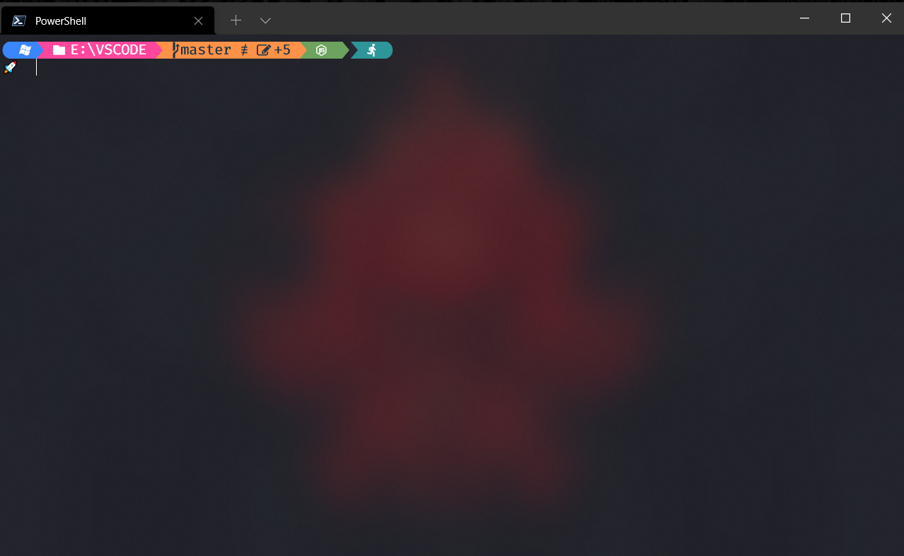

# oh my posh powershell developer config and theme

# Microsoft Store

## Install Windows Terminal in Microsoft Store

 [Windows Terminal in Microsoft Store](https://www.microsoft.com/en-us/p/windows-terminal/9n0dx20hk701?activetab=pivot:overviewtab)

# Winget Install setup

 [Winget Install link](https://github.com/microsoft/winget-cli/releases/download/v1.0.11692/Microsoft.DesktopAppInstaller_8wekyb3d8bbwe.msixbundle)

# Winget in Windows Terminal
## Installing Winget
    winget install Windows Terminal

# Powershell 
 
 Install Powershell7 or using default  Powershell

# PowerShell7 install 

[Powershell 7 Install link](https://github.com/PowerShell/PowerShell/releases)

## open your PowerShell as Administrator and run the following command
#
## Enter the command in PowerShell as Administrator
    Set-ExecutionPolicy Unrestricted

## Open Normal Powershell Installing OhMyPosh Using PowerShell, install Posh-Git and Oh-My-Posh:
#
## Installing Posh-Git
    Install-Module posh-git -Scope CurrentUser
   
## Installing Oh-My-Posh
    Install-Module oh-my-posh -Scope CurrentUser
## Installing PSReadLine 
    Install-Module -Name PSReadLine -Scope CurrentUser -Force -SkipPublisherCheck
   

## Installing module for icons  in PowerShell To install the module from the PowerShell Gallery:
#
## Installing Terminal-Icons
    Install-Module -Name Terminal-Icons -Repository PSGallery

# Installing and Configuring Fonts
  
  [FiraCode Nerd Font](https://github.com/mukunthan7/OhMyGod-Theme/tree/main/FiraCode%20Nerd%20Font)
  
  You can install it with double click

  Now, to set the fonts in terminal:

  In that configuration file oyu have to add configuration for you default profile or specifically for your 
  powershell 7 or Default PowerShell

# Oh My God Theme

